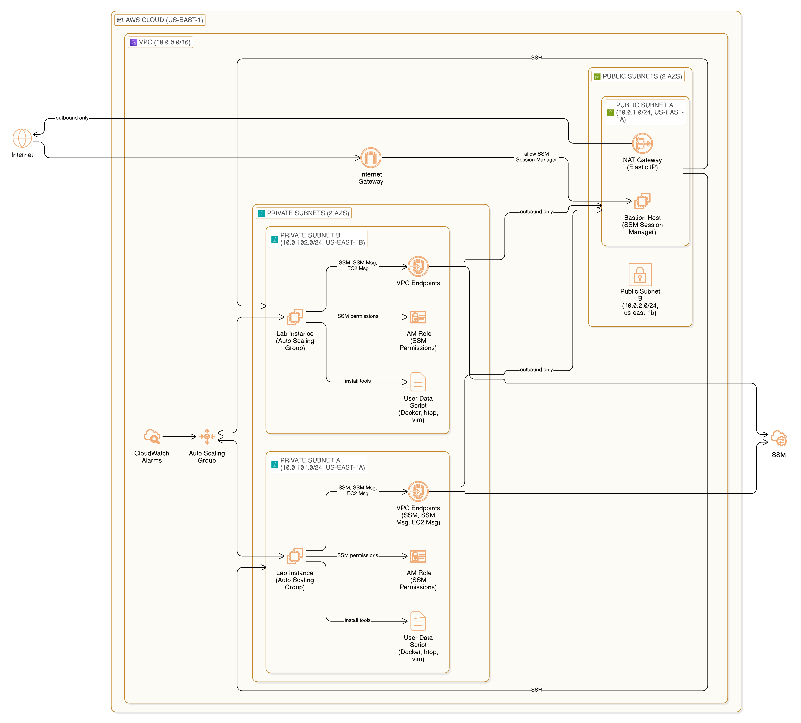

# Linux Lab on AWS

A production-ready Terraform project for creating a Linux practice lab environment on AWS with Auto Scaling, SSM Session Manager access, and comprehensive tooling.


## Features

- **Multi-AZ VPC** with public and private subnets
- **Bastion Host** with SSM Session Manager (no SSH exposure)
- **Auto Scaling Group** for lab instances with scaling policies
- **VPC Endpoints** for private SSM access
- **User Data Script** with pre-installed Linux tools and Docker
- **Cost Optimized** - easy to destroy and recreate

## Architecture

<div align="center">
  
</div>

## Pre-installed Tools

The lab instances come with these tools pre-installed:

| Category | Tools |
|----------|-------|
| System | htop, iotop, sysstat, tmux, vim |
| Network | tcpdump, nmap, netcat, curl, wget, iperf3 |
| Development | git, jq, build-essential, aws-cli |
| Containers | docker, docker-compose |
| Security | fail2ban, ufw |

## Quick Start

### 1. Clone and Configure

```bash
git clone https://github.com/salles-anderson/terraform-aws-ec2.git
cd terraform-aws-ec2

cp terraform.tfvars.example terraform.tfvars
# Edit terraform.tfvars with your settings
```

### 2. Deploy

```bash
terraform init
terraform plan
terraform apply
```

### 3. Connect to Instances

**Via SSM Session Manager (Recommended):**

```bash
# Connect to Bastion
aws ssm start-session --target <bastion-instance-id>

# Connect directly to Lab Instance
aws ssm start-session --target <lab-instance-id>
```

**Via SSH through Bastion:**

```bash
ssh -J ec2-user@<bastion-public-ip> ubuntu@<lab-private-ip>
```

### 4. Destroy When Done

```bash
terraform destroy
```

## Project Structure

```
.
├── main.tf                 # Provider and locals
├── vpc.tf                  # VPC, subnets, NAT, IGW, VPC Endpoints
├── security-groups.tf      # Security groups
├── iam.tf                  # IAM roles for SSM
├── bastion.tf              # Bastion host
├── asg.tf                  # Auto Scaling Group and policies
├── outputs.tf              # Output values
├── variables.tf            # Input variables
├── terraform.tfvars.example # Example configuration
├── scripts/
│   └── user-data.sh        # Instance bootstrap script
└── docs/
    └── architecture-diagram.png
```

## Variables

| Variable | Description | Default |
|----------|-------------|---------|
| `project_name` | Project name for resource naming | `linux-lab` |
| `environment` | Environment (dev, staging, prod) | `dev` |
| `aws_region` | AWS region | `us-east-1` |
| `vpc_cidr` | VPC CIDR block | `10.0.0.0/16` |
| `instance_type` | Lab instance type | `t3.micro` |
| `asg_min_size` | Minimum ASG size | `1` |
| `asg_max_size` | Maximum ASG size | `3` |
| `asg_desired_capacity` | Desired ASG capacity | `1` |

## Outputs

| Output | Description |
|--------|-------------|
| `vpc_id` | VPC ID |
| `bastion_instance_id` | Bastion instance ID |
| `bastion_ssm_command` | SSM command to connect to Bastion |
| `asg_name` | Auto Scaling Group name |
| `ssm_connect_instructions` | Full connection instructions |

## Security Features

- **No SSH exposed** - Access via SSM Session Manager only
- **Private subnets** - Lab instances in private subnets
- **VPC Endpoints** - SSM access without internet exposure
- **IMDSv2 required** - Enhanced instance metadata security
- **Encrypted volumes** - EBS encryption enabled

## Cost Optimization

- Use `terraform destroy` when not practicing
- Single NAT Gateway (not HA) for lab purposes
- t3.micro instances (Free Tier eligible)
- Auto Scaling to scale down during low usage

## Using Reusable Modules

For production environments, consider using the reusable Terraform modules library:

**[modules-aws-tf](https://github.com/salles-anderson/modules-aws-tf)** - 45+ production-ready AWS modules

## Author

**Anderson Sales** - DevOps Cloud Engineer

[](https://www.linkedin.com/in/salesanderson)
